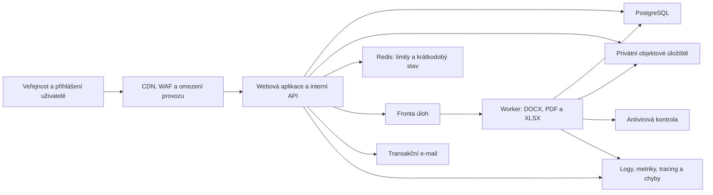
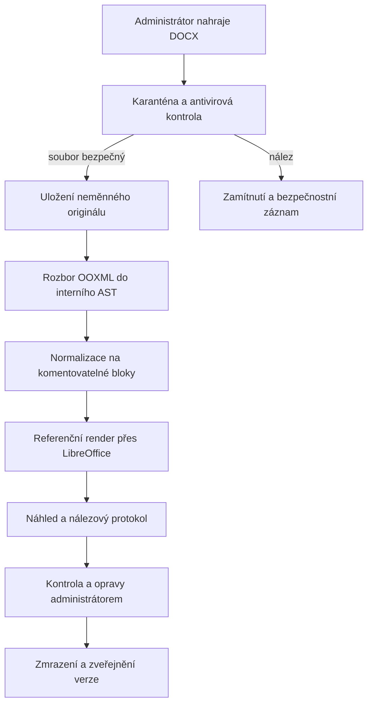
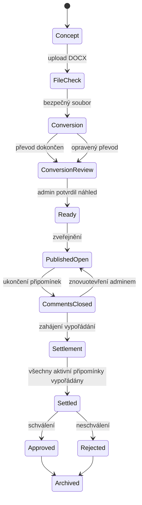
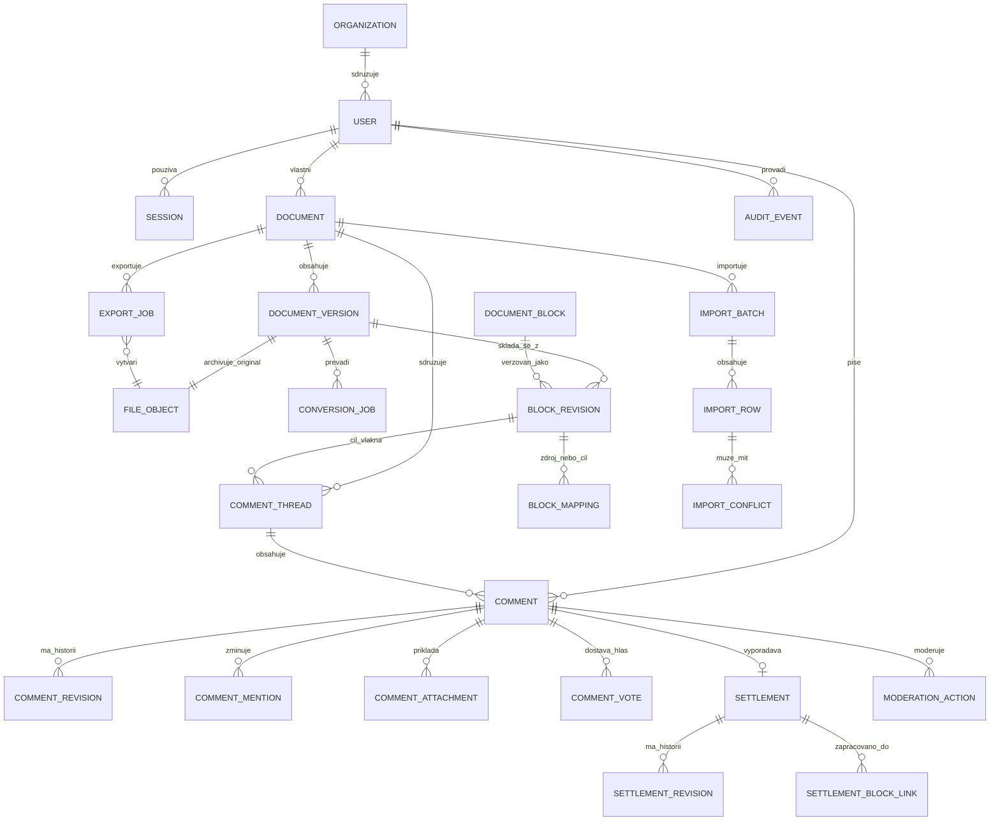

# Produkční architektura platformy pro připomínkování dokumentů

**Stav:** schválený návrh architektury

**Datum:** 16. 8. 2026

**Rozsah:** produkční pokračování existující pilotní aplikace Sokol spolurozhoduje

**Kapacitní předpoklad:** do 10 000 registrovaných uživatelů v prvních třech letech, návrhová rezerva přibližně do 50 000 uživatelů

## 1. Cíl a závazná rozhodnutí

Cílem je převést stávající browserovou demoverzi na produkčně použitelnou webovou aplikaci pro zveřejnění, blokové připomínkování, vypořádání a verzování dokumentů. Návrh záměrně zachovává již ověřené uživatelské rozhraní, role, pravidla oprávnění a automatické testy.

Závazná rozhodnutí:

- architektura je modulární monolit, nikoli soustava mikroslužeb;
- produkční provoz tvoří dvě nasaditelné části: webová aplikace se stejnodoménovým interním API a asynchronní worker;
- primárním úložištěm je PostgreSQL, binární soubory jsou v privátním objektovém úložišti;
- původní DOCX se vždy uchovává beze změny;
- komentáře se vážou ke stabilnímu identifikátoru textového bloku a ke konkrétní revizi bloku;
- veřejné integrační API, webhooky a napojení na členskou databázi jsou odloženy;
- obsah a připomínky nejsou důvěrné; e-mail, členské ID a interní identifikátory veřejné nejsou;
- za dokument, jeho zveřejnění, připomínky, jejich vypořádání i uzavření odpovídá jeden administrátor;
- role garanta, moderátora a samostatného zpracovatele se nezavádějí;
- princip čtyř očí je volitelný pro jednotlivý dokument a druhým schvalovatelem je superadministrátor;
- veřejná browserová demoverze může během vývoje zůstat dostupná, ale není zdrojem produkčních dat.

## 2. Co se převezme z pilotu

### Beze změny nebo s malou úpravou

- landing page, detail normy, administrace dokumentů a uživatelů;
- přihlašovací dialog, profil uživatele a uživatelské menu;
- responzivní vzhled, logo, písma a přístupnost;
- význam rolí `superadmin`, `admin`, `member` a veřejného návštěvníka;
- pravidlo, že administrátor spravuje jen vlastní dokumenty a superadministrátor všechny;
- pravidla pro komentáře, hlasování, vypořádání a stav dokumentu;
- existující demo data jako testovací fixtures;
- existující automatické testy a browserový smoke test.

### Zachované rozhraní, nová serverová implementace

- `AuthService`, `UserService`, `NormService` a `AuditService`;
- kontrolér aplikace, který místo browserového úložiště volá interní API;
- rozhraní pro ukládání souborů, za kterým bude objektové úložiště;
- komponenty formulářů, doplněné o blokový dokument, náhled převodu a import/export.

### Nahrazené produkčními službami

- `localStorage` a browserový repository nahradí PostgreSQL;
- IndexedDB pro soubory nahradí privátní objektové úložiště;
- klientské ověřování administrátorů nahradí serverové Argon2id a vícefaktorové ověření;
- demo schránka a modelové kódy zůstanou pouze ve vývojovém režimu;
- klient již nebude rozhodovat o oprávnění ani o platnosti přechodu stavu.

## 3. Topologie systému

Web a interní API jsou jedna TypeScript aplikace pod jednou doménou. Worker je oddělený proces, protože převod DOCX, renderování tabulek, PDF a XLSX jsou výpočetně náročnější a používají Java/LibreOffice nástroje. Komunikace s workerem je asynchronní přes frontu; stav úlohy je uložen v databázi.

Prostředí jsou minimálně `development`, `staging` a `production`. Každé má oddělenou databázi, úložiště, tajné hodnoty a frontu.

## 4. Aplikační moduly

Modulární monolit obsahuje následující jasně oddělené moduly:

1. **Identity a přístup** — uživatelé, organizace, e-mailové kódy členů, hesla a MFA administrátorů, relace a role.
2. **Dokumenty** — metadata, odpovědný administrátor, stavy, volitelný princip čtyř očí a číslování.
3. **Soubory a převod** — bezpečný upload, archiv originálu, převod DOCX, nálezové protokoly a náhled.
4. **Bloky a verze** — stabilní bloky, jejich revize, editace převodu a mapování mezi verzemi.
5. **Připomínky** — vlákna, odpovědi, zmínky, přílohy, historie úprav, hlasování a administrátorská moderace.
6. **Vypořádání** — stanovisko, výsledek, odpovědná verze a vazba na zapracované bloky.
7. **Export a import** — veřejné/interní PDF, pracovní XLSX, kontrolovaný zpětný import a řešení konfliktů.
8. **Notifikace** — e-mailové zprávy z transakčního outboxu.
9. **Audit a bezpečnost** — neměnná auditní stopa, bezpečnostní události a provozní dohled.

Moduly spolu komunikují přes aplikační služby a explicitní rozhraní. Přímé zápisy do tabulek jiného modulu nejsou povolené mimo definovanou transakční službu.

## 5. Převod DOCX na webový dokument

### 5.1 Tok zpracování

Originální DOCX je vždy archivován jako privátní, verzovaný a po dobu platnosti záznamu neměnný objekt. Každý derivát má kontrolní součet a vazbu na originál i konkrétní převodní úlohu.

### 5.2 Interní reprezentace

DOCX se přes docx4j převede do interního AST a následně na tyto bloky:

- `heading` — nadpis s úrovní a případným původním číslováním;
- `paragraph` — běžný odstavec;
- `list_item` — číslovaná nebo odrážková položka s identifikátorem seznamu, úrovní a typem značky;
- `table` — dostupná HTML tabulka s buňkami, záhlavími a sloučeními;
- `table_image` — obraz komplikované tabulky s alternativním popisem a odkazem na přílohu;
- `attachment_reference` — odkaz na samostatně uchovaný obsah;
- `quote` nebo `callout` — významově odlišený blok;
- `technical_separator` — technický předěl, který se běžně nekomentuje.

Uvnitř bloků se zachovávají značky tučného písma, kurzívy, podtržení, zvýraznění a bezpečně normalizované odkazy. Nebezpečné protokoly, aktivní obsah, makra a vložené skripty se nepřenášejí.

### 5.3 Komplikované tabulky

Administrátor u každé problematické tabulky zvolí jednu z variant:

1. dostupná HTML tabulka;
2. obrázek s alternativním popisem a původní tabulkou jako samostatnou přílohou;
3. pouze samostatná příloha doplněná vysvětlujícím komentovatelným blokem.

Systém doporučí variantu podle složitosti sloučení, vnořeného obsahu a výsledku porovnání s referenčním renderem, konečné rozhodnutí však provede administrátor v náhledu.

### 5.4 Stabilní identita bloků

- `block_uid` je UUIDv7 a označuje logický blok napříč verzemi;
- `block_revision_id` je UUIDv7 a označuje konkrétní obsah bloku v jedné verzi;
- připomínkové vlákno ukládá oba identifikátory;
- publikovaná revize bloku se nikdy nepřepisuje, změna vytváří novou revizi.

Při nové verzi se bloky mapují podle, v tomto pořadí:

1. DOCX bookmarků a `w14:paraId`, pokud jsou dostupné a důvěryhodné;
2. normalizovaného obsahu;
3. cesty nadpisů a sousedních bloků;
4. podobnosti textu a pozice.

Výsledkem je vztah `unchanged`, `modified`, `moved`, `split`, `merged` nebo `removed` s mírou jistoty. Nejednoznačné vztahy musí administrátor potvrdit. Původní připomínka se nikdy nepřepíše; na novou verzi se jen zobrazí potvrzená projekce.

## 6. Role a oprávnění

| Role | Oprávnění |
|---|---|
| Veřejnost | Čte zveřejněné dokumenty, veřejné připomínky a veřejné PDF. Nemůže aktivně přispívat. |
| Ověřený uživatel | Po ověření e-mailu komentuje bloky, odpovídá, používá zmínky, přikládá povolené soubory a hlasuje v otevřeném období. |
| Administrátor | Zakládá dokumenty, které vlastní; nahrává a opravuje převod; zveřejňuje; spravuje připomínky; vypořádává; exportuje/importuje; uzavírá vlastní dokumenty. |
| Superadministrátor | Spravuje všechny dokumenty a uživatele, vytváří administrátory, převádí vlastnictví dokumentu, řeší výjimky a případné druhé schválení. |

Individuální výjimky v oprávněních se nepoužívají. Změna vlastníka je explicitní superadministrátorská operace s auditem. Všechny kontroly oprávnění probíhají na serveru; skryté tlačítko v UI není bezpečnostní kontrola.

## 7. Workflow dokumentu

České popisky stavů v UI jsou: Koncept, Kontrola souboru, Převod, Kontrola převodu, Připraveno, Zveřejněno a otevřeno, Připomínky uzavřeny, Vypořádání, Vypořádáno, Schváleno, Neschváleno, Archivováno.

Administrátor dokumentu provádí všechny obsahové kroky. Je-li pro dokument zapnut princip čtyř očí, zveřejnění a konečné uzavření čeká na schválení superadministrátorem. Bez této volby žádný druhý schvalovatel není potřeba.

Dokument nelze označit jako vypořádaný, dokud nemají všechny aktivní připomínky výsledek a odůvodnění. Superadministrátor může udělit výjimku jen s povinným veřejným důvodem; výjimka je součástí auditu i interního exportu.

Administrátor může připomínku skrýt, obnovit, zamknout vlákno nebo odstranit přílohu. Každá moderace vyžaduje veřejný důvod a může obsahovat neveřejnou interní poznámku. Obsah se logicky skryje, fyzicky se nemaže z auditní historie.

## 8. Datový model a ER diagram

Všechny primární klíče jsou UUIDv7. Uživatelsky čitelné identifikátory jsou samostatné a nemění se, například `SOKOL-2026-001` pro dokument a `PRIP-2026-000123` pro připomínku. Časy se ukládají v UTC a zobrazují v lokální zóně uživatele. Měnitelné záznamy mají `row_version` pro optimistické zamykání.

## 9. Tabulky databáze

### 9.1 Identity a přístup

| Tabulka | Účel a hlavní pole | Vazby a pravidla |
|---|---|---|
| `organizations` | Jednoty a další organizace: `id`, název, kód, stav. | 1:N k uživatelům; organizace se nemaže, pokud je používána. |
| `users` | `id`, jméno, příjmení, e-mail, členské ID, `organization_id`, role, stav, ověření e-mailu, poslední přihlášení. | E-mail je unikátní bez ohledu na velikost písmen (`citext`); e-mail a členské ID jsou neveřejné. |
| `admin_credentials` | Hash hesla Argon2id, parametry hashe, stav MFA, datum změny. | 0:1 k uživateli; jen pro admina a superadmina. Tajné MFA hodnoty jsou šifrované aplikačním klíčem. |
| `login_challenges` | Hash jednorázového šestiznakového kódu, účel, expirace, počet pokusů, spotřebování. | N:1 k uživateli nebo čekající registraci; nikdy neukládá čitelný kód. |
| `sessions` | Hash identifikátoru relace, uživatel, expirace, rotace, odvolání a bezpečnostní metadata. | N:1 k uživateli; cookie je `Secure`, `HttpOnly`, `SameSite`. |
| `notification_preferences` | Volby e-mailových oznámení podle typu události. | 1:1 k uživateli; bezpečnostní zprávy nelze vypnout. |

### 9.2 Dokumenty, soubory a převod

| Tabulka | Účel a hlavní pole | Vazby a pravidla |
|---|---|---|
| `documents` | Veřejné číslo, název, důvodová zpráva, vlastník, stav, termíny, režim viditelnosti, volba čtyř očí, aktuální publikovaná verze. | Vlastník musí být aktivní admin; superadmin může vlastnictví převést. |
| `document_versions` | Číslo verze, `document_id`, původní DOCX, stav, vytvoření, publikace, kontrolní součet webového obsahu. | Publikovaná verze je neměnná; nový obsah vytváří novou verzi. |
| `document_approvals` | Požadavek, rozhodnutí, superadmin, datum a důvod druhého schválení. | Vzniká jen při zapnutém principu čtyř očí. |
| `document_state_transitions` | Původní a nový stav, aktér, čas a povinný důvod vybraných přechodů. | Append-only historie stavu dokumentu. |
| `file_objects` | Logické metadata objektu: účel, bucket/key, MIME, velikost, checksum, AV stav, vlastník dat a retenční třída. | Binární obsah není v DB; objekt je privátní a stahuje se přes krátkodobý podepsaný odkaz. |
| `conversion_jobs` | Verze, stav, parser/render verze, zahájení/konec, chyba a retry metadata. | N:1 k verzi dokumentu; opakování je idempotentní. |
| `conversion_findings` | Upozornění na tabulky, nepodporované prvky a rozdíly renderu, závažnost a rozhodnutí admina. | N:1 k převodní úloze; závažné nálezy blokují zveřejnění. |
| `document_blocks` | `block_uid`, dokument, čas vzniku a případného logického zániku. | Stabilní logická identita napříč verzemi. |
| `block_revisions` | Konkrétní verze bloku: typ, pořadí, strukturovaný obsah, čistý text, hash, komentovatelnost. | N:1 k logickému bloku i verzi dokumentu; unikátní pořadí v rámci verze. |
| `block_assets` | Obrázky tabulek a další deriváty uvnitř bloků, alternativní text a `file_object_id`. | N:1 k revizi bloku; dostupnost alternativního textu je validační podmínka. |
| `block_mappings` | Zdrojová a cílová revize, vztah, jistota, metoda a potvrzující admin. | Podporuje přesun, rozdělení, sloučení a odstranění mezi verzemi. |
| `block_edit_revisions` | Historie oprav převedeného bloku v náhledu, před/po, autor a důvod. | Append-only; editace publikované verze není dovolena. |

### 9.3 Připomínky a vypořádání

| Tabulka | Účel a hlavní pole | Vazby a pravidla |
|---|---|---|
| `comment_threads` | Veřejné ID, dokument, `block_uid`, cílová revize, stav vlákna a autor prvního komentáře. | Každé vlákno míří na konkrétní blok a jeho původní revizi. |
| `comments` | Vlákno, rodič odpovědi, autor, organizace v okamžiku podání, text, typ, priorita, stav a čas. | Strom odpovědí; fyzické mazání není běžná operace. |
| `comment_revisions` | Předchozí znění komentáře, editor, čas a důvod úpravy. | Append-only historie; veřejnost vidí označení úpravy, oprávnění vidí historii dle politiky. |
| `comment_mentions` | Komentář, zmíněný uživatel a stav notifikace. | N:M přes vazební tabulku; zmínka nezvyšuje oprávnění k neveřejnému obsahu. |
| `comment_attachments` | Komentář, `file_object_id`, veřejný název a stav moderace. | Jen povolené typy a AV-clean soubory. |
| `comment_votes` | Komentář, uživatel a hodnota hlasu `-1` nebo `1`. | Jeden hlas uživatele na komentář; hlasování jen v otevřené fázi. |
| `moderation_actions` | Cíl, akce, administrátor, veřejný důvod, volitelná interní poznámka a čas. | Append-only; změna viditelnosti se odvozuje z poslední platné akce. |
| `thread_version_projections` | Vlákno, cílová verze/revize, mapování, stav potvrzení a admin. | Umožňuje zobrazení staré připomínky u nové verze bez přepisu originálu. |
| `settlements` | Připomínka, výsledek, stanovisko, admin, datum, cílová verze a aktuální revize vypořádání. | 0:1 k připomínce; stanovisko a výsledek jsou pro dokončení povinné. |
| `settlement_revisions` | Historie změn výsledku a stanoviska včetně důvodu a autora. | Append-only auditovatelná historie. |
| `settlement_block_links` | Vypořádání a revize bloků, do nichž byla změna zapracována. | N:M; povinné pro výsledek tvrdící zapracování, pokud cílová verze existuje. |
| `comment_status_transitions` | Historie přechodů stavu připomínky. | Append-only; přechody validuje doménová služba. |
| `closure_exceptions` | Dokument, superadmin, veřejný důvod a seznam nevypořádaných položek při výjimečném uzavření. | Výjimečný mechanismus, nikoli běžná cesta. |

Číselníky `comment_types`, `priority_codes`, `comment_status_codes`, `settlement_outcomes` a `document_status_codes` obsahují stabilní kód, český název, pořadí, aktivitu a čas platnosti. Výsledky vypořádání jsou: přijato, částečně přijato, odmítnuto, vysvětleno bez změny, duplicita, mimo rozsah a vzato zpět.

### 9.4 Export, import, audit a notifikace

| Tabulka | Účel a hlavní pole | Vazby a pravidla |
|---|---|---|
| `export_jobs` | Dokument, typ PDF/XLSX, veřejná/interní varianta, filtry, snapshot data, stav, autor a výstupní soubor. | Export je reprodukovatelný z neměnného snapshotu. |
| `import_batches` | Zdrojový XLSX, dokument, manifest, stav, autor, časy a souhrn. | Každá dávka má unikátní idempotency key. |
| `import_rows` | Řádek listu, veřejné ID připomínky, importované hodnoty, validační stav a snapshot při exportu. | N:1 k dávce; ukládá se i normalizovaný hash. |
| `import_conflicts` | Pole, hodnota při exportu, aktuální hodnota, importovaná hodnota a typ konfliktu. | N:1 k řádku; konflikt nelze aplikovat bez rozhodnutí. |
| `import_decisions` | Konflikt, rozhodnutí zachovat/přepsat/sloučit, admin, čas a odůvodnění. | Každé přepsání vyžaduje výslovné potvrzení. |
| `audit_events` | Aktér, role, operace, cíl, výsledek povoleno/odmítnuto, čas, correlation ID, redigovaná metadata a hash předchozí události. | Append-only, hash-chain, DB role bez UPDATE/DELETE. |
| `outbox_events` | Doménová událost vytvořená ve stejné transakci jako změna, payload, stav a počet pokusů. | Zaručuje spolehlivé předání workeru/notifikacím. |
| `notification_deliveries` | Událost, příjemce, kanál, stav, pokusy a odpověď poskytovatele bez tajných údajů. | N:1 k outbox události; opakování je idempotentní. |
| `security_events` | Neúspěšná přihlášení, omezení rychlosti, malware, změna MFA a další bezpečnostní jevy. | Oddělená omezeně přístupná evidence. |

## 10. Integritní pravidla

- Dokument má právě jednoho odpovědného administrátora.
- Aktuální publikovaná verze musí patřit dokumentu a mít stav `published`.
- Publikovanou verzi, revizi bloku, komentářovou historii, vypořádací historii a audit nelze aktualizovat ani fyzicky mazat.
- Soubor nesmí být použit ani zveřejněn před úspěšnou antivirovou kontrolou.
- Vlákno, blok a verze musí patřit stejnému dokumentu.
- Hlasovat a komentovat lze jen při otevřeném připomínkování a s ověřeným e-mailem.
- Všechny důležité zápisy probíhají v transakci spolu s auditní nebo outbox událostí.
- Optimistické konflikty se vracejí jako konflikt verze; server nesmí tiše přepsat novější data.
- Běžné odstranění je logické. Fyzická likvidace je řízený retenční proces se samostatným protokolem.

## 11. Interní aplikační API

API je pouze interní rozhraní mezi browserem a serverem na stejné doméně pod `/api`. V první fázi se neposkytují integrační klienti, API klíče, webhooky, GraphQL ani veřejná dokumentace pro třetí strany.

Skupiny operací:

- přihlášení, ověření e-mailu, relace, profil a správa uživatelů;
- dokumenty, stavy, vlastnictví a schválení;
- předpodepsaný upload do karantény a autorizovaný download;
- verze, převodní úlohy, nálezy, bloky a náhled;
- připomínky, odpovědi, zmínky, přílohy, hlasy a moderace;
- vypořádání, uzavření a výjimky;
- spuštění, stav a stažení exportu;
- nahrání, náhled, rozhodnutí konfliktů a aplikace importu.

Pravidla rozhraní:

- server ověřuje relaci, roli, vlastnictví i stav dokumentu u každé operace;
- změny používají `ETag`/`If-Match` nebo ekvivalentní `row_version`;
- opakovatelné příkazy používají `Idempotency-Key`;
- dlouhé úlohy vracejí `202 Accepted` a odkaz na stav;
- chyby mají formát RFC Problem Details a `correlation_id`;
- upload jde přímo do karantény přes krátkodobý podepsaný odkaz;
- CORS nepovoluje cizí domény a stavové operace mají CSRF ochranu;
- interní OpenAPI slouží pro typování, contract testy a správu změn, nikoli jako veřejný produkt.

## 12. Export PDF

PDF vzniká asynchronně z databázového snapshotu. Obsahuje:

1. titulní stranu s číslem, názvem a verzí dokumentu;
2. datum, typ exportu, použité filtry a identifikátor snapshotu;
3. statistiku připomínek podle typu, priority, stavu a výsledku;
4. seznam připomínek s cílovým blokem, vláknem odpovědí, stanoviskem a stavem;
5. informaci o verzi a blocích, do kterých byla změna zapracována;
6. přílohu s filtry, vysvětlivkami a případnými výjimkami uzavření.

Veřejná varianta obsahuje veřejné ID, jméno, organizaci, text, veřejné přílohy, odpovědi, stanovisko a stav. Neobsahuje e-mail, členské ID, interní UUID, IP adresu, bezpečnostní metadata ani interní poznámku.

Interní varianta je dostupná jen administrátorům a může volitelně doplnit interní identifikátory, historii, interní poznámky a technická metadata. Citlivá pole nejsou předvolena.

Doporučeným formátem je PDF/A-2u s vloženými fonty, textovou vrstvou, záložkami, opakovanými záhlavími tabulek a kontrolou dostupnosti. Výstup má checksum, dobu platnosti a audit stažení.

## 13. Pracovní XLSX

XLSX je dostupné pouze administrátorům a obsahuje listy:

- **Připomínky** — jeden řádek na připomínku;
- **Statistiky** — souhrny a kontingenční přehledy bez maker;
- **Číselníky** — povolené hodnoty pro validace;
- **Pokyny** — pracovní postup a význam barev;
- **_Manifest** — skrytý technický list s verzí schématu, dokumentem, snapshotem a kontrolními součty.

Uzamčená systémová pole: ID dokumentu, verze, bloku a připomínky, autor, organizace, datum, původní text, `row_version` a hash snapshotu.

Editovatelná pole: typ, priorita, stav, výsledek vypořádání, stanovisko, cílová verze a interní poznámka. Sešit používá filtrování, zmrazené záhlaví, validaci přes číselníky a podmíněné formátování. Ochrana listu brání náhodné změně, není však bezpečnostní hranicí.

### Bezpečný zpětný import

1. upload do karantény a antivirová kontrola;
2. kontrola formátu, manifestu, verze schématu a kontrolních součtů;
3. validace řádků, typů a hodnot vůči číselníkům;
4. třícestné porovnání: snapshot při exportu vs. aktuální databáze vs. importovaný sešit;
5. náhled změn rozdělený na bezkonfliktní, konfliktní a neplatné;
6. explicitní rozhodnutí administrátora pro každý konflikt nebo bezpečnou skupinu konfliktů;
7. nová kontrola `row_version` bezprostředně před zápisem;
8. transakční aplikace bezkonfliktních a potvrzených změn;
9. audit dávky, řádků, konfliktů a rozhodnutí.

Import nikdy automaticky nepřepíše hodnotu, která se od exportu změnila. Opakované odeslání stejné dávky nevytvoří duplicitní změny.

## 14. Doporučený technologický stack

### Aplikace

- React a Next.js s TypeScriptem pro web a stejnodoménové interní API;
- TanStack Query pro serverový stav;
- React Hook Form a Zod pro formuláře a sdílené validační kontrakty;
- ProseMirror/Tiptap jen pro řízené opravy bloků v náhledu, nikoli jako obecný editor dokumentu;
- PostgreSQL s typovanou migrační vrstvou;
- Redis pro rate limiting a krátkodobá data, nikoli jako zdroj pravdy.

### Worker

- Java a docx4j pro deterministické zpracování OOXML;
- Apache POI pro XLSX;
- LibreOffice v izolovaném kontejneru pro referenční render a obrazové deriváty;
- PDFBox a veraPDF pro sestavení a validaci PDF/A;
- ClamAV nebo spravovaná rovnocenná služba pro antivirovou kontrolu.

### Doporučené provozní služby v EU

- Azure Container Apps pro aplikaci a worker;
- Azure Database for PostgreSQL;
- Azure Blob Storage s versioningem a immutable policy pro archivní objekty;
- Azure Cache for Redis;
- Azure Service Bus;
- Azure Key Vault;
- Azure Front Door/WAF;
- transakční e-mail s evropským zpracováním dat;
- OpenTelemetry a Sentry v EU nebo rovnocenné monitorování.

Infrastruktura se zapisuje v Terraformu a nasazuje přes GitHub Actions. Aplikační adaptéry pro objektové úložiště, frontu a e-mail omezují závislost na jednom dodavateli. Kubernetes se pro tento objem nezavádí.

## 15. Přihlášení a bezpečnost

- Běžný uživatel se registruje jménem, příjmením, organizací/jednotou, volitelným členským ID a e-mailem.
- Aktivní účast vyžaduje funkční e-mail ověřený jednorázovým šestiznakovým kódem.
- Při dalších návštěvách se člen přihlašuje novým jednorázovým kódem zaslaným na e-mail.
- Administrátor a superadministrátor používají nastavitelné heslo uložené jako Argon2id hash a povinné MFA.
- Relace používají bezpečné HttpOnly cookies, rotaci po přihlášení a citlivých změnách a možnost okamžitého odvolání.
- Změny role, vlastníka, MFA, hesla, zveřejnění, uzavření, interní export a potvrzení konfliktního importu vyžadují nové ověření podle rizika.
- Soubory jsou vždy privátní, procházejí karanténou a AV; odkazy ke stažení mají krátkou platnost.
- HTML se negeneruje přímým vložením obsahu DOCX; renderuje se z povoleného strukturovaného modelu s CSP.
- Rate limiting chrání přihlášení, kódy, komentáře, hlasování, uploady a exporty.
- Logy a audit redigují hesla, kódy, tokeny, cookies, citlivé hlavičky a obsah souborů.

## 16. Provoz, dostupnost a obnova

Výchozí provozní cíle:

- dostupnost aplikace 99,5 % měsíčně;
- RPO nejvýše 15 minut;
- RTO nejvýše 4 hodiny;
- point-in-time recovery PostgreSQL;
- denní zálohy databáze a verzování objektového úložiště;
- záložní kopie v druhém regionu EU;
- čtvrtletní praktický test obnovy;
- kapacitní alarmy pro databázi, frontu, úložiště a worker.

Nasazení probíhá přes kontrolovaný tok: feature branch, automatické testy a bezpečnostní kontroly, preview, staging, kontrola migrací, schválení produkce, nasazení, smoke test a sledování. Databázové změny používají postup expand–migrate–contract. Destruktivní migrace se automaticky nevracejí rollbackem.

Provozní dohled sleduje zejména přihlášení, nedoručené kódy, chybovost API, délku fronty, dobu převodu, AV nálezy, konflikty importu, chyby exportu, využití databáze a neobvyklé administrátorské operace. Pro incidenty existují runbooky pro nedostupnost, frontu, obnovu DB, kompromitovaný účet, škodlivý soubor a chybný import.

Navržené retenční výchozí hodnoty, které musí před produkcí potvrdit správce osobních údajů a archivní pravidla ČOS:

- dokumenty, verze, připomínky, vypořádání a obsahový audit podle schváleného spisového/archivního režimu;
- bezpečnostní logy 12 měsíců;
- dočasné exporty 30 dní;
- zamítnuté soubory v karanténě jen po dobu potřebnou k vyšetření, typicky několik dní;
- zrušené relace a expirované přihlašovací výzvy po krátké provozní lhůtě.

## 17. Testovací strategie

Stávající testy pilotu zůstávají regresní základnou a postupně se převádějí na testy společných kontraktů. Produkční sada obsahuje:

- unit testy oprávnění, stavových přechodů, mapování bloků a třícestného porovnání;
- integrační testy proti skutečné PostgreSQL a objektovému úložišti;
- contract testy interního API a kompatibility UI/služeb;
- golden DOCX dokumenty pro nadpisy, odstavce, seznamy, tabulky, zvýraznění a odkazy;
- snapshoty normalizovaného AST a deterministické kontrolní součty;
- testy redakce veřejného PDF a XLSX;
- testy konfliktů, idempotence a souběžné změny při importu;
- end-to-end scénáře registrace, přihlášení, uploadu, náhledu, publikace, připomínkování, vypořádání a uzavření;
- negativní autorizační testy pro cizí dokument a každou roli;
- testy přístupnosti dle WCAG 2.2 AA;
- zátěžové testy pro špičku komentování, hlasování, upload a frontu workeru;
- bezpečnostní skeny závislostí, kontejnerů, tajných údajů a penetrační test před pilotním produkčním provozem;
- pravidelný test obnovy ze záloh.

## 18. Optimalizovaný etapový plán pro práci s Codexem

Práce je rozdělena do malých, samostatně ověřitelných balíčků. Každý balíček má testy, build, krátký browserový scénář a dokumentovaný výsledek. Codex nejdříve upravuje stávající rozhraní a komponenty; nové paralelní řešení vytváří jen tam, kde pilotní implementace nemůže být produkční.

### Etapa A — autoritativní kontrakty a serverový základ (balíčky 1–4)

1. sjednotit typy, repository/service rozhraní, API chyby a contract testy; doplnit projektová pravidla pro Codex;
2. zavést PostgreSQL, migrace, transakce, outbox a audit;
3. implementovat serverové přihlášení, relace, role, MFA a správu uživatelů;
4. implementovat dokumenty, vlastnictví, stavy a připojit stávající UI k internímu API.

### Etapa B — soubory, DOCX a blokové připomínky (balíčky 5–9)

5. objektové úložiště, karanténa, AV, originální soubor a podepsané odkazy;
6. základní převod DOCX do AST a podporovaných bloků;
7. stabilní bloky, nálezový protokol a administrátorský náhled s opravami;
8. převést cílení stávajících komentářů na `block_uid` a `block_revision_id`;
9. doplnit vlákna, historii, zmínky, přílohy, administrátorskou moderaci a vypořádání s cílovou verzí.

Po balíčku 9 je možné spustit první serverový pilot: bezpečný upload DOCX, převod, publikace, blokové komentování a vypořádání.

### Etapa C — verze a exporty (balíčky 10–13)

10. nová verze dokumentu a automatické jednoduché mapování bloků;
11. potvrzení nejasných mapování a projekce starých připomínek;
12. veřejné PDF a automatické testy redakce;
13. interní PDF, filtry, PDF/A validace a provoz exportních úloh.

### Etapa D — pracovní XLSX (balíčky 14–16)

14. generování chráněného XLSX s manifestem, číselníky, validacemi a statistikou;
15. bezpečný upload, validace a třícestný náhled importu;
16. rozhodování konfliktů, transakční aplikace a úplný audit.

### Etapa E — produkční připravenost (balíčky 17–18)

17. Azure infrastruktura, staging, CI/CD, monitoring, alarmy a zálohy;
18. bezpečnostní a zátěžové ověření, test obnovy, runbooky a řízený produkční pilot.

Rozdělení/slučování bloků s komplikovaným uživatelským rozhraním, veřejné API, napojení na členskou databázi, důvěrné připomínky, mikroslužby a Kubernetes jsou mimo první produkční rozsah.

## 19. Akceptační kritéria první produkční verze

První produkční verze je připravena k pilotu, pokud současně platí:

- veřejnost bezpečně čte publikované dokumenty a jejich veřejná vypořádání;
- ověřený uživatel se přihlásí e-mailovým kódem a připomínkuje konkrétní blok;
- administrátor se přihlásí heslem a MFA a spravuje pouze vlastní dokumenty;
- superadministrátor spravuje vše a může změnit vlastníka;
- DOCX projde karanténou, archivací, převodem, kontrolou náhledu a publikací;
- nadpisy, odstavce, seznamy, odrážky, tabulky, zvýraznění a odkazy projdou golden testy;
- originál i všechny publikované verze zůstávají dohledatelné a neměnné;
- komentáře mají vlákna, odpovědi, zmínky, přílohy, historii, moderaci a audit;
- administrátor vypořádá připomínky a systém zabrání běžnému předčasnému uzavření;
- veřejné PDF neobsahuje interní údaje a interní PDF je přístupné pouze oprávněným rolím;
- XLSX import odhalí konflikt a bez výslovného rozhodnutí nic konfliktního nepřepíše;
- všechny kritické operace mají auditní stopu a citlivé hodnoty nejsou v logu;
- automatické testy, přístupnost, zátěžová kontrola, penetrační ověření a obnova ze zálohy splní schválené limity;
- staging i produkce jsou reprodukovatelně nasazeny z verzované infrastruktury.

## 20. Rozhodnutí nutná před produkčním spuštěním

Následující položky nemění architekturu, ale musí mít vlastníka a datum schválení před zpracováním reálných osobních údajů:

1. přesné retenční a archivní lhůty schválené správcem osobních údajů a archivními pravidly ČOS;
2. vybraný Azure region EU a schválený provozní rozpočet;
3. poskytovatel transakčního e-mailu a smluvní zpracování dat v EU;
4. povolené typy a maximální velikosti příloh;
5. přesná dostupnost, RPO a RTO ve smluvních/provozních cílech;
6. obsah zásad ochrany osobních údajů, podmínek užití a moderace;
7. osoby odpovědné za incidenty, obnovu, správu klíčů a produkční nasazení.

Tyto volby se evidují jako rozhodovací záznamy (ADR) a nesmějí zůstat skryté jen v konfiguraci nebo v konverzaci.
