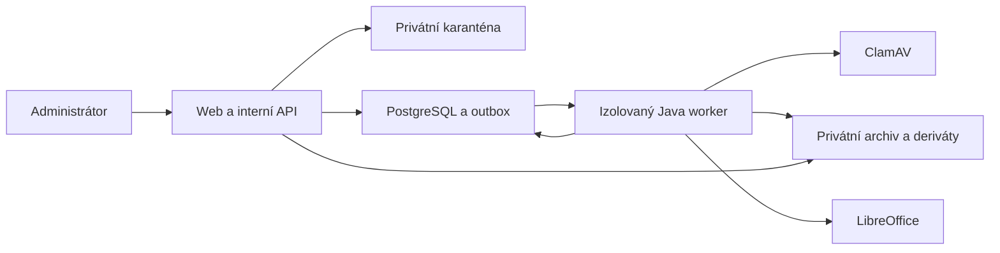

# Bezpečný příjem DOCX, převod a administrátorský náhled

**Stav:** schválený návrh

**Datum:** 17. 8. 2026

**Rozsah:** etapa B, balíčky 5–7 produkční architektury platformy Sokol spolurozhoduje

## 1. Cíl

Cílem této etapy je navázat na hotový serverový základ a dodat bezpečný, auditovatelný tok od nahrání DOCX po administrátorem zkontrolovanou strukturovanou verzi připravenou ke zveřejnění. Řešení musí zachovat originální soubor, převést podporované prvky do stabilních bloků a dát administrátorovi možnost opravit strukturu převodu bez tiché změny textu.

Etapa končí stavem `ready`. Samotné blokové komentování, vlákna, zmínky, přílohy připomínek a přenos připomínek mezi verzemi patří do následujících balíčků 8–9.

## 2. Závazná rozhodnutí

- Stávající TypeScript web a interní API zůstávají hlavní aplikací.
- Převod provádí izolovaný Java worker s knihovnami docx4j a LibreOffice.
- PostgreSQL je zdrojem pravdy pro metadata, stavy, bloky, nálezy a audit.
- Binární objekty jsou v privátním objektovém úložišti: lokálně Azurite, produkčně Azure Blob Storage.
- ClamAV provádí antivirovou kontrolu před archivací a převodem.
- V této etapě slouží databázový outbox také jako jednoduchá fronta úloh. Redis ani samostatný broker se nezavádějí.
- Originální DOCX je po úspěšné bezpečnostní kontrole archivován beze změny a je neměnný.
- Systém automaticky doporučí způsob zobrazení komplikované tabulky, konečnou volbu provede administrátor.
- Administrátor smí opravit klasifikaci a strukturu bloků, nikoli vlastní text dokumentu. Oprava textu vyžaduje novou verzi DOCX.
- Publikovaná verze a její blokové revize jsou neměnné.
- Administrátor spravuje pouze vlastní dokumenty, superadministrátor všechny dokumenty.

## 3. Hranice rozsahu

### Součást etapy

- upload DOCX přes webovou aplikaci;
- karanténa, validace a antivirová kontrola;
- archivace čistého originálu a autorizované krátkodobé stažení;
- asynchronní převod OOXML do interního AST;
- převod AST na podporované webové bloky;
- referenční render přes LibreOffice;
- vyhodnocení komplikovaných tabulek;
- stabilní identifikátory bloků v první verzi;
- nálezový protokol;
- responzivní administrátorský náhled a strukturální opravy;
- kontrola připravenosti, audit a provozní diagnostika.

### Mimo etapu

- komentáře, odpovědi, zmínky, přílohy připomínek a hlasování;
- vypořádání připomínek;
- automatické mapování bloků mezi různými verzemi DOCX;
- PDF a XLSX export/import;
- veřejné integrační API;
- přímé napojení na členský systém;
- Redis, Service Bus, Kubernetes a samostatné mikroslužby.

## 4. Topologie a odpovědnosti



### Webová aplikace

- ověřuje relaci, roli a vlastnictví dokumentu;
- přijímá upload proudově bez načtení celého souboru do paměti;
- provádí základní kontrolu názvu, velikosti, MIME, ZIP signatury a OOXML obalu;
- ukládá soubor pouze do karantény;
- ve stejné databázové transakci založí verzi, souborová metadata, převodní úlohu a outbox událost;
- poskytuje stav zpracování, náhled, administrátorské opravy a krátkodobé autorizované odkazy.

### Worker

- pronajímá úlohy z databáze a zpracovává je idempotentně;
- provádí hloubkovou kontrolu ZIP/OOXML a antivirovou kontrolu;
- přesune čistý originál do archivu bez změny bytů;
- vytvoří AST, bloky, referenční render, obrazové deriváty a nálezy;
- neobsluhuje uživatelské relace a není veřejně dostupný;
- zapisuje pouze přes definované aplikační repository a auditní rozhraní.

### Úložiště

Logické kontejnery jsou:

- `quarantine` — nově nahrané a dosud neověřené objekty;
- `originals` — čisté neměnné originální DOCX;
- `derivatives` — náhledy, obrazy tabulek a další reprodukovatelné výstupy.

Všechny kontejnery jsou neveřejné. Názvy objektů jsou generované systémem a neobsahují uživatelský e-mail, členské ID ani původní cestu. Původní název se uchovává pouze jako redigované metadata v databázi.

## 5. Bezpečný příjem souboru

### 5.1 Limity a prvotní validace

- povolená přípona je pouze `.docx`;
- maximální velikost uploadu je 25 MiB;
- maximální rozbalená velikost OOXML balíčku je 250 MiB;
- maximální počet ZIP položek je 10 000;
- maximální kompresní poměr jedné položky je 100:1;
- soubor musí mít ZIP signaturu, `[Content_Types].xml`, vztah k hlavnímu Word dokumentu a platný hlavní XML dokument;
- soubory s VBA projektem, vloženým spustitelným obsahem nebo aktivními OLE objekty jsou odmítnuty;
- externí vztahy se při převodu nenačítají ze sítě;
- celý upload musí skončit do 120 sekund.

Neúspěšná prvotní validace vytvoří auditovaný zamítavý výsledek, ale nezaloží zpracovatelnou převodní úlohu.

### 5.2 Antivirová kontrola

Stav `av_status` má hodnoty:

- `pending` — čeká na kontrolu;
- `clean` — kontrola dokončena bez nálezu;
- `infected` — potvrzený nález;
- `error` — kontrolu nebylo možné spolehlivě dokončit.

Pouze objekt se stavem `clean` lze přesunout do `originals` a předat parseru. `infected` se neopakuje automaticky, není dostupný ke stažení a vytváří bezpečnostní událost. `error` je přechodná chyba a řídí se pravidly opakování. Karanténní objekt se po úspěšné archivaci odstraní; zamítnutý objekt se uchová nejvýše 7 dní pro omezené bezpečnostní šetření a poté jej řízený retenční proces odstraní.

### 5.3 Integrita a soukromí

Při příjmu se počítá SHA-256. Po přesunu do archivu se hash znovu ověří; neshoda zpracování okamžitě zastaví. Originál dostane neměnnou retenční politiku a běžná aplikační role nemá právo jej přepsat ani smazat.

Stažení originálu nebo derivátu vyžaduje novou serverovou autorizaci. Server vydá odkaz pro jediný objekt s platností nejvýše 5 minut. Odkaz se nikdy neukládá do auditu ani aplikačních logů.

## 6. Stavový model

### 6.1 Stav verze dokumentu

```text
file_check -> conversion -> conversion_review -> ready
```

- `file_check` — objekt je v karanténě nebo probíhá AV kontrola;
- `conversion` — čistý originál je archivován a probíhá převod;
- `conversion_review` — převod skončil a čeká na administrátorskou kontrolu;
- `ready` — náhled je potvrzen a nic nebrání zveřejnění.

Při terminální chybě zůstává verze v poslední bezpečné fázi a nese samostatný chybový stav úlohy. Stav dokumentu se neposouvá automaticky dál, dokud úloha neskončí úspěšně.

### 6.2 Stav převodní úlohy

`conversion_jobs.status` má hodnoty:

- `queued`;
- `leased`;
- `scanning`;
- `archiving`;
- `parsing`;
- `rendering`;
- `analyzing`;
- `completed`;
- `retry_wait`;
- `failed`;
- `rejected`.

`failed` označuje technickou chybu po vyčerpání pokusů. `rejected` označuje bezpečnostní nebo validační odmítnutí, které se bez nového souboru neopakuje.

### 6.3 Fronta, pronájem a opakování

Worker vybírá dostupné úlohy transakčně pomocí databázového zámku odpovídajícího `FOR UPDATE SKIP LOCKED`. Pronájem má časovou platnost a může jej obnovovat pouze vlastník pronájmu. Po pádu workeru se expirovaná úloha bezpečně uvolní.

Přechodné chyby se opakují nejvýše třikrát s prodlevami 1, 5 a 20 minut. Každý krok je idempotentní podle kombinace `document_version_id`, SHA-256 originálu a verze převodního profilu. Již vytvořený objekt se znovu použije pouze při shodě hashe; rozdílný obsah se nikdy nepřepíše.

Administrátor může po terminální technické chybě spustit nový pokus. Bezpečnostně odmítnutý nebo strukturálně neplatný soubor vyžaduje nový upload.

## 7. Převod DOCX do strukturovaného dokumentu

### 7.1 Interní AST

docx4j načte OOXML bez vykonávání maker, externích vztahů nebo vloženého aktivního obsahu. První mezivýsledek je interní AST, který odděluje obsah od prezentace a uchovává původní zdrojová metadata potřebná pro stabilní identitu a diagnostiku.

Podporované bloky:

- `heading` — nadpis včetně úrovně a původního číslování;
- `paragraph` — běžný odstavec;
- `list_item` — odrážka nebo číslovaná položka včetně úrovně a identity seznamu;
- `table` — dostupná HTML tabulka;
- `table_image` — obraz komplikované tabulky s alternativním textem a odkazem na originální přílohu;
- `attachment_reference` — samostatná příloha s vysvětlujícím textem;
- `quote`;
- `callout`;
- `technical_separator` — technický nekomentovatelný předěl.

Uvnitř textových bloků se zachovává tučné písmo, kurzíva, podtržení, zvýraznění a bezpečné odkazy. Povolené odkazy používají pouze `https`, `http` nebo `mailto`; ostatní protokoly se odstraní a vytvoří nález.

### 7.2 Referenční render

LibreOffice vytvoří v izolovaném procesu referenční PDF nebo obrazové stránky. Render neslouží jako zdroj webového textu; používá se pro vizuální kontrolu, výřezy komplikovaných tabulek a diagnostiku rozdílů. Proces nemá přístup k veřejné síti, běží jako neprivilegovaný uživatel a má omezenou paměť, CPU, disk i čas 180 sekund.

### 7.3 Komplikované tabulky

Každá tabulka dostane skóre složitosti. Zvyšují je zejména:

- vertikální nebo horizontální slučování buněk;
- vnořené tabulky;
- více než 20 sloupců nebo 200 řádků;
- obrázky, textová pole nebo více odstavců v buňce;
- nestejná struktura řádků;
- významný rozdíl mezi strukturálním a referenčním renderem.

Systém doporučí jednu z variant:

1. `html` — dostupná webová tabulka;
2. `image_with_attachment` — obrázek s povinným alternativním popisem a původní tabulkou jako přílohou;
3. `attachment_only` — samostatná příloha a komentovatelný vysvětlující blok.

Doporučení je automatické, ale před stavem `ready` ho musí administrátor potvrdit nebo změnit. Ruční změna se audituje. Obrázková varianta bez alternativního popisu je blokující nález.

## 8. Stabilní bloky a datový model

Všechny primární identifikátory jsou UUIDv7. V rámci první nahrané verze je `block_uid` vytvořen deterministicky z nejspolehlivějšího dostupného zdroje:

1. důvěryhodný DOCX bookmark nebo `w14:paraId`;
2. jinak kombinace cesty nadpisů, typu bloku, normalizovaného obsahu a sousedních bloků.

Kolize se řeší deterministickým pořadovým doplňkem. Opakovaný převod stejného souboru se stejným převodním profilem musí vytvořit stejné logické bloky a stejné `block_uid`. `block_revision_id` označuje konkrétní uloženou revizi a při schválené strukturální změně vzniká nová revize.

Automatické mapování `block_uid` mezi odlišnými verzemi DOCX není součástí této etapy. Již nyní se však ukládají bookmark, `w14:paraId`, normalizovaný hash, cesta nadpisů, sousední hashe, původní pořadí a verze parseru, aby další etapa mohla mapovat bez změny schématu.

### 8.1 Tabulky

#### `file_objects`

- `id`, `purpose`, `container`, `object_key`, `original_name`;
- deklarovaný a zjištěný MIME, velikost a SHA-256;
- `av_status`, čas kontroly a redigovaný kód výsledku;
- stav objektu `quarantined`, `archived`, `derivative`, `rejected`, `deleted`;
- vlastník dat, retenční třída, časy vytvoření a řízeného odstranění;
- `row_version`.

#### `document_versions`

- dokument, pořadové číslo verze a stav;
- `original_file_id`, aktivní převodní profil a kontrolní součet webového obsahu;
- vytvořil, časy vytvoření, potvrzení náhledu a publikace;
- odkaz na aktuální úspěšnou převodní úlohu;
- `row_version`.

#### `conversion_jobs`

- verze dokumentu, stav a aktuální krok;
- parser, LibreOffice, antivirová a převodní profilová verze;
- počet pokusů, další čas pokusu, pronájem a heartbeat;
- zahájení, dokončení, redigovaný kód chyby a `correlation_id`;
- vstupní hash a idempotency key.

#### `conversion_findings`

- převodní úloha, volitelný blok nebo zdrojové místo;
- kód, závažnost `info`, `warning`, `blocking`;
- bezpečná česká zpráva a strukturované diagnostické údaje;
- stav `open`, `accepted`, `resolved`;
- rozhodující administrátor, čas a povinné odůvodnění u přijetí rizika.

Blokující nález nelze pouze přijmout jako riziko; musí být odstraněn novým uploadem nebo povolenou strukturální opravou.

#### `document_blocks`

- `block_uid`, dokument, čas vzniku a logického zániku;
- zdrojová identita: bookmark, `w14:paraId`, cesta nadpisů a sousední hashe.

#### `block_revisions`

- `block_revision_id`, `block_uid`, verze dokumentu a pořadí;
- typ bloku, strukturovaný JSON obsah, bezpečný čistý text a normalizovaný hash;
- komentovatelnost;
- zdrojový rozsah, parser verze a původ revize `converted` nebo `admin_structure_edit`;
- vytvořil a čas vytvoření.

#### `block_assets`

- revize bloku, `file_object_id`, účel a pořadí;
- alternativní text, rozměry a kontrolní součet;
- zvolená reprezentace tabulky.

#### `block_edit_revisions`

- verze dokumentu a dotčený logický blok;
- původní a nová strukturální data;
- typ změny, administrátor, čas a povinný důvod;
- odkazy na původní a novou revizi bloku.

### 8.2 Integritní pravidla

- verze dokumentu, originál, úloha a bloky musí patřit stejnému dokumentu;
- jeden archivní originál nelze přepsat ani zaměnit za jiný hash;
- dokončená úloha má právě jeden konzistentní převodní výstup;
- v jedné verzi je pořadí bloků unikátní a souvislé;
- publikovanou revizi nelze měnit;
- strukturální oprava vždy vytvoří novou revizi a auditní záznam;
- text a inline obsah nové strukturální revize musí být významově shodný se zdrojovou revizí; povolená je pouze změna typu, hranic, pořadí, komentovatelnosti, tabulkové reprezentace a technických metadat;
- textová změna vyžaduje nový DOCX a novou verzi dokumentu.

## 9. Administrátorský náhled

Rozhraní je čtyřkrokový průvodce.

### 9.1 Nahrání

- volba DOCX a informace, zda jde o první nebo novou verzi;
- průběžný stav uploadu, kontroly, archivace a převodu;
- srozumitelná bezpečná chyba s možností nového uploadu nebo povoleného opakování;
- opuštění stránky nezruší serverové zpracování.

### 9.2 Porovnání

- na desktopu strukturovaný webový dokument vedle referenčního renderu;
- na mobilu dvě přepínatelné záložky se zachováním stejného aktivního bloku;
- panel nálezů s filtrem závažnosti a přechodem na konkrétní blok;
- jasné označení automatického doporučení tabulky a jeho důvodu.

### 9.3 Strukturální opravy

Administrátor může:

- změnit typ bloku;
- sloučit nebo rozdělit hranice bloků bez změny pořadí znaků;
- změnit pořadí pouze u technicky chybně zařazených bloků;
- zapnout či vypnout komentovatelnost;
- vložit nebo odstranit technický oddělovač;
- potvrdit nebo změnit reprezentaci komplikované tabulky;
- doplnit alternativní text.

Text se zobrazuje pouze ke čtení. Server odmítne požadavek, jehož normalizovaný textový obsah neodpovídá dovolené transformaci. Každá oprava vyžaduje důvod a aktualizuje `row_version`.

### 9.4 Souhrnná kontrola

- počet bloků, tabulek a nálezů podle závažnosti;
- seznam nesplněných podmínek;
- potvrzení administrátora;
- přechod do `ready`, pouze pokud jsou všechny blokující podmínky splněny.

Rozhraní používá klávesnicové ovládání, viditelný fokus, stavové ARIA popisy a minimální cíle ovládání 44 × 44 px. Dlouhé dokumenty se vykreslují virtualizovaně, ale aktivní blok a nález musí zůstat dostupný asistivním technologiím.

## 10. Interní aplikační rozhraní

Rozhraní není veřejné integrační API; obsluhuje pouze stejnodoménovou aplikaci.

- `POST /api/documents/{documentId}/versions/uploads` — proudový upload DOCX, vyžaduje `Idempotency-Key`;
- `GET /api/document-versions/{versionId}/processing` — bezpečný stav a průběh;
- `POST /api/conversion-jobs/{jobId}/retry` — nový pokus po povolené technické chybě;
- `GET /api/document-versions/{versionId}/preview` — bloky, nálezy a odkazy na referenční stránky;
- `PATCH /api/document-versions/{versionId}/blocks/{blockUid}` — strukturální oprava s `If-Match` a důvodem;
- `POST /api/conversion-findings/{findingId}/decision` — povolené rozhodnutí administrátora;
- `POST /api/document-versions/{versionId}/review-completion` — kontrola podmínek a potvrzení náhledu;
- `POST /api/file-objects/{fileId}/download-link` — krátkodobý autorizovaný odkaz.

Každý zápis ověřuje relaci, roli, vlastnictví, stav dokumentu, CSRF ochranu, idempotenci a optimistickou verzi. Odpovědi neobsahují interní objektové klíče. Chyby používají Problem Details, stabilní aplikační kód a `correlation_id`; zásobník, cesta ani surový výstup parseru se uživateli nevrací.

## 11. Přechod do `ready`

Verzi lze potvrdit jako připravenou pouze tehdy, pokud současně platí:

- originál existuje v archivu a jeho hash odpovídá přijatému souboru;
- AV stav originálu je `clean`;
- převodní úloha je `completed`;
- existuje alespoň jeden platný blok;
- nejsou otevřené blokující nálezy;
- každá komplikovaná tabulka má potvrzenou reprezentaci;
- každý obrázkový obsah vyžadující popis má neprázdný alternativní text;
- administrátor potvrdil náhled nad aktuální `row_version`;
- verze není publikovaná ani nahrazená novější rozpracovanou verzí.

Kontrola proběhne v jedné serverové transakci. Selhání vrátí úplný bezpečný seznam nesplněných podmínek a nic částečně neposune.

## 12. Audit a provozní dohled

Auditují se úspěšné i odmítnuté pokusy o upload, stažení, retry, strukturální opravu, rozhodnutí nálezu a potvrzení náhledu. Audit obsahuje aktéra, roli, dokument/verzi, operaci, výsledek, čas, `correlation_id` a redigovaná metadata. Neobsahuje binární obsah, podepsané odkazy, cookies, tokeny ani plný surový výstup antiviru/parseru.

Provozní metriky:

- počet a velikost uploadů;
- čekací a celková doba zpracování;
- délka databázové fronty a stáří nejstarší úlohy;
- počty retry, failed, rejected a AV nálezů;
- doba jednotlivých kroků workeru;
- počty nálezů podle kódu a závažnosti;
- využití CPU, paměti a dočasného disku workeru.

Alarm vznikne při stáří nejstarší úlohy nad 10 minut, pěti technických selháních během 15 minut, nedostupnosti ClamAV nebo objektového úložiště a při každém potvrzeném AV nálezu.

## 13. Testovací strategie

### 13.1 Golden dokumenty

Verzované testovací DOCX pokrývají:

- nadpisy, odstavce, číslované seznamy a odrážky;
- tučné písmo, kurzívu, podtržení, zvýraznění a bezpečné odkazy;
- jednoduché tabulky, sloučené buňky, vnořenou a rozměrnou tabulku;
- obrázky a více odstavců v buňce;
- bookmarky a `w14:paraId`;
- poškozený ZIP, neplatný OOXML, falešnou příponu a nepovolený aktivní obsah;
- kontrolovaný EICAR testovací vzorek pro ClamAV;
- ZIP bombu reprezentovanou bezpečnou malou fixture, která překročí stanovené limity bez vyčerpání prostředků.

### 13.2 Automatické testy

- unit testy validátorů, stavových přechodů, skóre tabulek a strukturálních oprav;
- snapshot testy normalizovaného AST;
- deterministický test stejných `block_uid` při opakovaném převodu stejného zdroje;
- integrační testy se skutečným PostgreSQL, Azurite a ClamAV;
- idempotence, pronájem, pád workeru, retry a souběžní workeři;
- kontrola SHA-256 před a po archivaci;
- negativní autorizační testy všech operací pro veřejnost, člena a cizího administrátora;
- kontrola, že úložiště neposkytuje veřejné objekty a odkaz je krátkodobý;
- zákaz změny textu přes strukturální endpoint;
- zákaz přechodu do `ready` při každé jednotlivé blokující podmínce;
- audit povolených i odmítnutých operací a redakce citlivých údajů;
- přístupnost a responzivita průvodce.

### 13.3 Browserový průchod

Skutečný prohlížeč ověří scénář:

```text
přihlášení administrátora
-> vytvoření nebo otevření vlastního dokumentu
-> upload DOCX
-> zobrazení průběhu bezpečnostní kontroly a převodu
-> kontrola webového a referenčního náhledu
-> otevření nálezu
-> potvrzení reprezentace komplikované tabulky
-> povolená strukturální oprava
-> potvrzení náhledu
-> stav ready
```

Samostatný negativní scénář ověří zamítnutí škodlivého souboru a zákaz správy dokumentu jiného administrátora. Průchod se provede v desktopovém i mobilním viewportu a musí skončit bez browserových a síťových chyb.

## 14. Akceptační kritéria

Etapa je dokončena pouze tehdy, když:

- čistý DOCX projde celým tokem od karantény do `ready`;
- škodlivý, neplatný, příliš velký nebo limit překračující soubor je bezpečně odmítnut;
- infikovaný soubor nikdy nevstoupí do archivu originálů ani do parseru;
- archivovaný originál má shodný SHA-256 a nelze jej běžnou aplikací přepsat;
- objektové kontejnery nejsou veřejné a stažení vyžaduje platnou autorizaci;
- golden dokumenty zachovají všechny podporované bloky a inline formátování;
- stejný vstup a převodní profil vytvoří stejné logické bloky;
- automatické doporučení tabulky je viditelné a administrátor má konečné rozhodnutí;
- administrátor může opravit strukturu, ale serverově nemůže změnit text;
- cizí administrátor nemůže dokument zobrazit v administraci, měnit ani stáhnout jeho originál;
- otevřený blokující nález, chybějící alternativní text nebo nedokončené zpracování zabrání stavu `ready`;
- všechny zásahy mají redigovanou auditní stopu;
- unit, integrační, contract, browserové a build kontroly projdou v čistém prostředí;
- Docker sestava spustí web, PostgreSQL, Azurite, ClamAV a worker jedním dokumentovaným postupem.

## 15. Dopad na následující etapy

Balíček 8 využije `block_uid` a `block_revision_id` jako povinný cíl připomínky. Balíček 9 přidá vlákna a vypořádání bez změny převodního modelu. Pozdější verzování doplní mapování mezi různými DOCX verzemi s využitím již uložených zdrojových identit, hashů, cesty nadpisů a sousedních bloků.

Produkční Azure Service Bus může později nahradit databázový pronájem úloh přes adaptér fronty. PostgreSQL zůstane zdrojem pravdy pro stav úloh, takže změna transportu nebude měnit uživatelské workflow ani datový model dokumentu.
