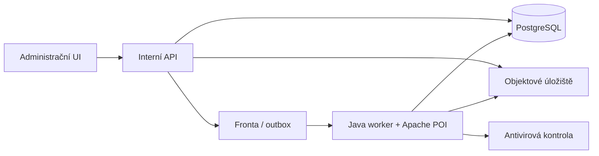
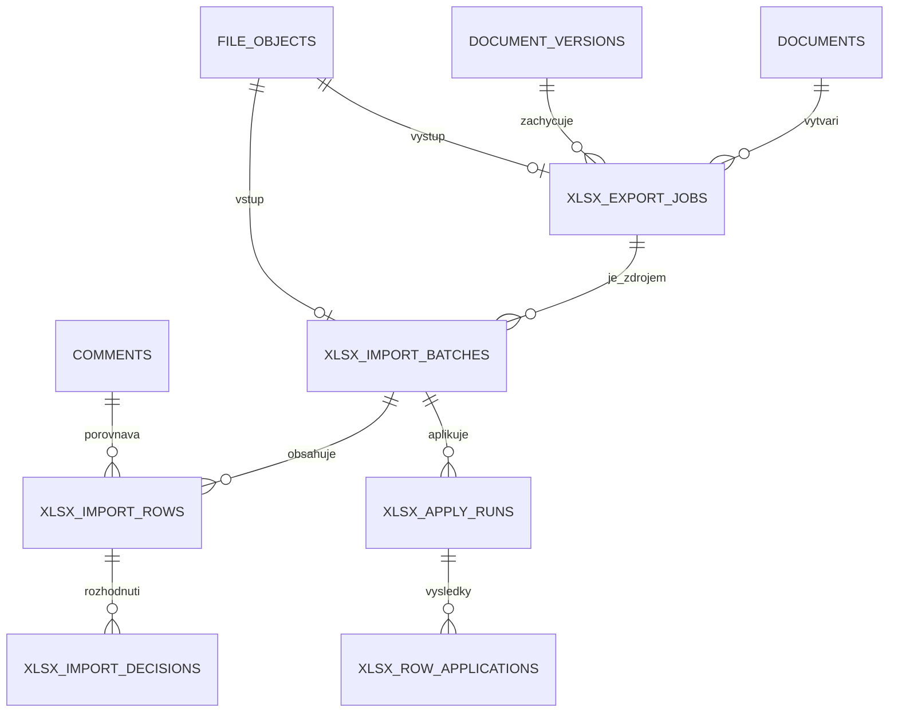

# Etapa D: pracovní XLSX a bezpečný zpětný import

Datum: 2026-08-19

Stav: schválený návrh
Rozsah: balíčky 14–16

## 1. Cíl a návaznost

Etapa D doplní produkční pracovní XLSX pro hromadné vypořádání připomínek. Navazuje na hotové části Etapy C: PostgreSQL, objektové úložiště, Java worker, interní stejno-doménové API, role a vlastnictví dokumentů, neměnné exportní snímky, `row_version`, outbox a hashovaný append-only audit.

Řešení nevytváří veřejné integrační API ani novou mikroslužbu. XLSX generuje a kontroluje stávající Java worker pomocí Apache POI. Webová aplikace poskytne správní rozhraní a interní API.

Závazná pravidla:

- XLSX je dostupné pouze rolím `admin` a `superadmin`;
- administrátor pracuje jen s vlastními dokumenty, superadministrátor se všemi;
- upload spouští změny, proto vyžaduje čerstvé přihlášení správce;
- jeden sešit patří právě jednomu dokumentu, jedné verzi a jedné exportní dávce;
- jeden sešit smí obsahovat nejvýše 1 000 pracovních řádků;
- interní e-mail a členské ID se do XLSX neexportují;
- systémová pole a původní obsah připomínky nelze importem změnit;
- bezkonfliktní platné změny se po validaci aplikují automaticky;
- konflikty se rozhodují po celých řádcích;
- žádná konfliktní data se nepřepíší bez výslovného rozhodnutí administrátora;
- úplná ověřovací brána proběhne jednou po balíčku 16; během vývoje poběží pouze malé cílené testy.

## 2. Zvolená technická varianta

Apache POI poběží v existujícím Java workeru. Tato varianta poskytuje spolehlivou práci s ochranou listů, datovými validacemi, pojmenovanými rozsahy, vzorci, podmíněným formátováním a bezpečným čtením OOXML. Zároveň využije již existující frontu, leasing úloh, objektové úložiště a provozní model workeru.



Ochrana listu je pouze ochranou proti nechtěné editaci. Bezpečnost a integritu zajišťuje serverová autorizace, neměnný základní snímek, podepsaný manifest, striktní parser a transakční kontrola verzí řádků.

## 3. Balíček 14: generování pracovního XLSX

### 3.1 Struktura sešitu

Sešit obsahuje přesně pět listů:

| List | Viditelnost | Účel |
|---|---|---|
| `Pokyny` | viditelný | návod, identifikace dokumentu, legenda |
| `Vypořádání` | viditelný | pracovní tabulka připomínek |
| `Statistika` | viditelný | orientační počty podle stavu, výsledku, typu a priority |
| `Číselníky` | skrytý a chráněný | povolené hodnoty datových validací |
| `Manifest` | very hidden a chráněný | identita exportu, verze schématu a kontrolní údaje |

Neočekávaný list, změněný název povinného listu nebo změněná struktura hlavičky je při importu strukturální chyba.

### 3.2 Sloupce pracovního listu

Uzamčená pole:

- veřejné ID připomínky;
- číslo a verze dokumentu;
- stabilní identifikátor a pořadí bloku;
- text bloku a text připomínky;
- autor, organizace a datum podání;
- technické verze řádků a kontrolní údaje.

Editovatelná pole:

- typ připomínky;
- priorita;
- stav připomínky;
- výsledek vypořádání;
- veřejné stanovisko;
- cílová verze zapracování;
- odpovědná osoba;
- datum vypořádání.

Interní poznámka nebude v první verzi pracovního XLSX. E-mail a členské ID nebudou v žádném uživatelském listu ani manifestu, protože pro import nejsou potřeba. Neveřejná databázová UUID smí být v manifestu jen v nezbytném rozsahu a nesmějí být považována za tajemství.

### 3.3 Doménová pravidla buněk

- typ, priorita, stav a výsledek používají rozbalovací číselníky;
- stav `settled` vyžaduje výsledek, neprázdné veřejné stanovisko, odpovědnou osobu a datum vypořádání;
- ručně zadané datum vypořádání smí být dnešní nebo minulé;
- ručně zadané datum se ukládá do `declared_settlement_date`, zatímco skutečný čas vzniku záznamu zůstává v `settled_at`;
- skutečný čas importu a aktér se vždy zapisují samostatně;
- cílová verze musí patřit témuž dokumentu;
- administrátor smí jako odpovědnou osobu vybrat pouze sebe;
- superadministrátor smí vybrat sebe nebo vlastníka dokumentu;
- volba odpovědné osoby nikdy nemění vlastnictví dokumentu;
- texty pocházející od uživatelů se zapisují jako řetězce, nikdy jako vzorce.

### 3.4 Formátování a statistika

Pracovní list má automatický filtr, zmrazené záhlaví, čitelné šířky sloupců, zalamování textu a legendu uzamčených/editovatelných polí. Podmíněné formátování zvýrazní neúplná vypořádání a neplatné hodnoty. Statistiky jsou orientační; import je nikdy nepoužije jako zdroj pravdy a přepočítá je ze serverových dat.

### 3.5 Manifest

Manifest obsahuje minimálně:

- `schemaVersion`;
- identifikátor exportní úlohy, dokumentu a verze;
- čas vytvoření;
- počet pracovních řádků;
- verzi číselníků;
- SHA-256 neměnného serverového snímku;
- identifikátor podpisového klíče;
- kryptografický podpis kanonických neměnných údajů;
- mapování pracovních řádků na komentáře a jejich zdrojové verze.

Autoritativní základní snímek zůstává v PostgreSQL. Manifest pouze prokazuje původ sešitu a odkazuje na tento snímek. Podpisový klíč je ve správci tajemství, nikoli v souboru nebo databázi. Rotace zachová po definovanou dobu ověřovací klíče pro dříve vydané sešity.

## 4. Balíček 15: bezpečný upload, validace a třícestný náhled

### 4.1 Zpracování uploadu

```text
čerstvé přihlášení
→ upload do karantény
→ kontrola obálky a limitů
→ antivirová kontrola
→ archivace originálního XLSX
→ ověření manifestu, role a vlastnictví
→ striktní načtení řádků
→ třícestné porovnání
→ automatická transakce bezpečných změn
→ náhled výsledků, chyb a konfliktů
```

Povolen je pouze `.xlsx`. `.xls`, `.xlsm`, makra, externí odkazy, formule v editovatelných buňkách, neočekávané listy/sloupce, další řádky a cizí manifest jsou odmítnuty. Parser chrání proti ZIP bombám, nadměrnému počtu XML uzlů, nepřiměřeným délkám textu a nadměrné spotřebě paměti. Maximální velikost souboru je 25 MB a maximální počet pracovních řádků 1 000.

Pořadí existujících řádků není významné; vazba používá stabilní identifikátory. Přidaný řádek je chyba. Chybějící řádek nikdy neznamená smazání nebo změnu připomínky.

### 4.2 Třícestné porovnání

Porovnávají se:

- `base`: neměnný stav v okamžiku exportu;
- `current`: aktuální stav databáze při importu;
- `incoming`: editovatelná pole z XLSX.

Řádek dostane právě jednu klasifikaci:

| Klasifikace | Podmínka | Výsledek |
|---|---|---|
| `unchanged` | incoming = base | žádný zápis |
| `safe_change` | incoming != base a current = base | automatická aplikace |
| `already_current` | incoming = current | žádný zápis |
| `conflict` | incoming i current se proti base změnily rozdílně | čeká na rozhodnutí |
| `invalid` | neplatné doménové hodnoty | bez zápisu, chyba v náhledu |
| `structural_error` | porušený sešit, podpis nebo rozsah | odmítnutí celé dávky |

Konflikt se vyhodnocuje po celém řádku. Odlišná souběžná změna jediného editovatelného pole znamená konflikt celého řádku.

Strukturální nebo bezpečnostní chyba zastaví celý import. Chyba jednoho pracovního řádku neblokuje ostatní platné bezpečné řádky. Automatická aplikace všech `safe_change` řádků je jedna transakce; při souběžné změně nebo jediné chybě se celá vrátí zpět a vytvoří se nový náhled.

Opakované nahrání téhož souboru se stejným idempotency key vrátí původní dávku. Stejný klíč s jiným obsahem je konflikt idempotence.

## 5. Balíček 16: konflikty, transakce a audit

### 5.1 Rozhodování konfliktů

UI zobrazí pro každý konfliktní řádek základní, aktuální a příchozí hodnoty a zvýrazní rozdíly. Administrátor zvolí pro celý řádek:

- `keep_system`: zachovat aktuální stav systému;
- `use_xlsx`: použít všechna validovaná editovatelná pole XLSX.

Hromadné rozhodnutí nad označenými řádky je dovoleno po zobrazení počtu dopadů. Uzamčená pole se nepřepisují nikdy. Rozhodnutí jsou append-only; případné nové rozhodnutí vytvoří další záznam a autoritativní je poslední platné rozhodnutí před aplikací.

### 5.2 Transakční aplikace

Import má dvě atomické fáze:

1. automatická transakce bezpečných řádků;
2. pozdější transakce všech rozhodnutých konfliktů.

Před každou transakcí systém zamkne dotčené komentáře a vypořádání, ověří `row_version`, roli, aktivní účet, vlastnictví dokumentu, stav dokumentu a doménová pravidla. Změna od posledního náhledu způsobí rollback celé příslušné fáze a nové porovnání.

Každý aplikovaný řádek atomicky:

- vytvoří potřebnou append-only doménovou historii;
- změní typ, prioritu a případně stav komentáře;
- vytvoří nebo aktualizuje vypořádání;
- nastaví odpovědnou osobu, cílovou verzi a ruční datum;
- zvýší příslušné `row_version`;
- zapíše audit a outbox událost.

Pokud XLSX vrátí připomínku ze stavu `settled` do `open` nebo `under_review`, aktuální vypořádání se nesmaže. Označí se jako neaktivní pomocí `voided_at`, `voided_by_user_id` a důvodu odkazujícího na importní dávku. Při příštím přechodu do `settled` vznikne nový aktivní záznam vypořádání. Pro jednu připomínku smí existovat nejvýše jedno aktivní vypořádání; všechna předchozí zůstávají trvale dohledatelná.

### 5.3 Audit

Audit zachytí vytvoření a stažení XLSX, přijetí/odmítnutí uploadu, kontroly souboru, kontrolní součty, klasifikaci řádků, automatické aplikace, konflikty, každé rozhodnutí, transakční výsledek, zrušení a dokončení dávky.

Událost obsahuje aktéra, roli, čas, korelační ID, dávku, dokument, připomínku, změněná pole a před/po hash. Hesla, tokeny, relace, e-mail ani členské ID se do auditu nezapisují. Obchodní hodnoty a jejich předchozí stav uchovávají specializované doménové revize; obecný audit je nenahrazuje.

## 6. Datový model



### `xlsx_export_jobs`

Dokument a verze, stav úlohy, neměnný snapshot a jeho SHA-256, verze XLSX schématu, key ID podpisu, žadatel, idempotency key, command hash, výstupní `file_object`, error údaje, pokusy, lease, `row_version` a časové údaje.

### `xlsx_import_batches`

Zdrojový export, dokument, vstupní `file_object`, stav dávky, uploadující uživatel, SHA-256 souboru, hash a key ID manifestu, idempotence, souhrnné počty, `row_version`, časové údaje a error údaje.

### `xlsx_import_rows`

Dávka, číslo pracovního řádku, komentář, zdrojové verze komentáře a vypořádání, `base_values`, `current_values`, `incoming_values`, klasifikace, validační chyby a vlastní `row_version`. Unikátní je dvojice dávka + komentář.

### `xlsx_import_decisions`

Append-only rozhodnutí pro importní řádek, volba `keep_system`/`use_xlsx`, aktér, očekávaná verze importního řádku, volitelný důvod a čas.

### `xlsx_apply_runs`

Fáze `safe_changes`/`conflict_resolutions`, stav, očekávaná verze náhledu, aktér, korelační ID, počty, chyba a časy.

### `xlsx_row_applications`

Neměnný výsledek aplikace řádku: apply run, importní řádek, výsledek, před/po hash a odkazy na vzniklé doménové revize.

### Úpravy existujících tabulek

- `file_objects.purpose`: přidat `xlsx_export`, `xlsx_import`;
- nová append-only historie změn typu a priority komentáře;
- `settlements`: nahradit současnou globální unikátnost `comment_id` částečným unikátním indexem pro jediné aktivní vypořádání, přidat `declared_settlement_date`, `voided_at`, `voided_by_user_id` a `void_reason`;
- `settlement_revisions`: uchovat také předchozí odpovědnou osobu, cílovou verzi a ruční datum;
- `comment_status_transitions`: nadále jediná historie stavových přechodů;
- `audit_events`: společný hashovaný audit beze změny bezpečnostního modelu.

Čtecí dotazy, veřejné zobrazení i PDF používají pouze aktivní vypořádání. Neaktivní záznamy jsou dostupné výhradně v oprávněné historii a auditu.

## 7. Interní API a UI

Veřejné API se nezavádí. Interní trasy:

```text
POST /api/documents/{id}/xlsx-exports
GET  /api/xlsx-exports/{jobId}
GET  /api/xlsx-exports/{jobId}/download
POST /api/documents/{id}/xlsx-imports
GET  /api/xlsx-imports/{batchId}
GET  /api/xlsx-imports/{batchId}/rows
POST /api/xlsx-imports/{batchId}/decisions
POST /api/xlsx-imports/{batchId}/apply-conflicts
POST /api/xlsx-imports/{batchId}/cancel
```

Mutace používají CSRF, idempotency key a `If-Match`. Výpis importních řádků je stránkovaný a filtrovatelný. Každá trasa znovu ověřuje serverovou relaci, roli a vlastnictví.

V detailu dokumentu vznikne záložka `Pracovní XLSX` s vytvořením sešitu, historií úloh, uploadem, průběhem kontroly, souhrnem výsledků a konfliktním porovnáním. Tabulky používají stránkování nebo existující virtualizaci, jsou ovladatelné klávesnicí a stavové změny mají přístupná živá hlášení.

## 8. Stavy dávky a zotavení

```text
uploaded → scanning → validating → comparing → applying_safe
                                             ├→ completed
                                             └→ awaiting_resolution
awaiting_resolution → applying_conflicts → completed
libovolný aktivní stav → failed
awaiting_resolution → cancelled
```

Retry smí pokračovat jen z bezpečného checkpointu a je idempotentní. Archivovaný vstupní XLSX se při retry nepřesouvá ani nemaže. Worker používá lease a počet pokusů; vyčerpané opakování skončí explicitním error kódem a administrátorskou možností bezpečného retry.

## 9. Provozní a bezpečnostní požadavky

- maximálně 25 MB a 1 000 pracovních řádků;
- streamované generování a eventové čtení OOXML;
- omezená paralelita XLSX úloh vůči DOCX/PDF;
- krátkodobé pracovní soubory s garantovaným cleanupem;
- archivace vstupního XLSX podle retenční politiky dokumentu;
- podpisový klíč ve správci tajemství a podporovaná rotace;
- metriky fronty, doby zpracování, konfliktů, chyb a odmítnutých podpisů;
- alert na opakované neplatné podpisy a podezřelé soubory;
- žádné důvěrné připomínky ani export interních identit.

## 10. Testovací strategie

Během balíčků se spouštějí pouze malé cílené testy změněné logiky. Kompletní ověření proběhne jednou po dokončení balíčku 16 a zahrne:

- jednotkové testy manifestu, číselníků, validací a třícestného algoritmu;
- golden XLSX testy přes Apache POI;
- integrační testy PostgreSQL a objektového úložiště;
- role, vlastnictví, čerstvou autentizaci a zamítnuté audity;
- idempotenci, souběh a stale preview;
- fault injection a úplný rollback každé aplikační fáze;
- makra, externí odkazy, vzorce, ZIP bombu a změněný manifest;
- reálný browserový tok export → stažení → úprava → upload → automatická změna → konflikt → rozhodnutí;
- přístupnost konfliktního rozhraní;
- úplnou testovací sadu, TypeScript kontrolu, Java testy/build, web build, migrace, smoke test a `git diff --check`.

## 11. Větvení a pořadí implementace

Etapa D vznikne v nové větvi založené na aktuálním výsledku Etapy C. Pull request Etapy C zůstane nezměněný. Etapa D bude dočasně stacked PR a po začlenění Etapy C se přesměruje na `main`.

Pořadí práce:

1. balíček 14 — migrace a kontrakty exportu, Apache POI generátor, úloha, stažení a UI;
2. balíček 15 — importní datový model, bezpečný upload/parser, třícestný algoritmus, automatická bezpečná transakce a náhled;
3. balíček 16 — rozhodnutí konfliktů, druhá transakce, historie, audit a UI;
4. jediná úplná ověřovací brána, opravy a závěrečný report.

## 12. Akceptační kritéria

- oprávněný správce vytvoří a stáhne chráněný XLSX pro nejvýše 1 000 připomínek;
- sešit obsahuje schválené listy, číselníky, validace, statistiku a podepsaný manifest;
- změna uzamčených dat, struktury nebo původu sešitu je spolehlivě odhalena;
- platné bezpečné změny se po uploadu aplikují automaticky a atomicky;
- konfliktní řádky se bez rozhodnutí nikdy nepřepíší;
- rozhodnutí `keep_system` a `use_xlsx` se aplikují po celých řádcích v jedné atomické fázi;
- souběžná změna způsobí rollback a nový náhled;
- typ, priorita, stav a úplné vypořádání mají dohledatelnou doménovou historii;
- znovuotevření vypořádané připomínky zneplatní staré vypořádání bez jeho smazání a nové vypořádání vytvoří jako nový aktivní záznam;
- export, upload, klasifikace, rozhodnutí i aplikace mají úplnou hashovanou auditní stopu;
- administrátor nepřekročí vlastnictví dokumentu a superadministrátor má globální přístup;
- e-mail a členské ID nejsou v XLSX ani auditních metadatech;
- závěrečná úplná ověřovací brána je zelená a doložená reportem.
